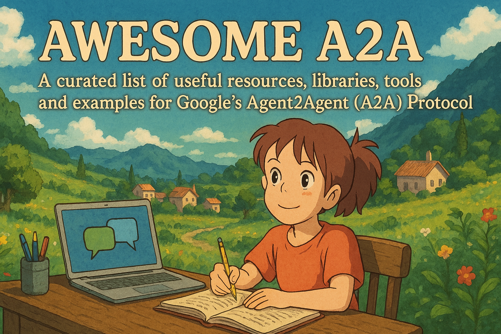

  
  

    A curated list of useful resources, libraries, tools and examples for Google's Agent2Agent (A2A) Protocol
  

  
  
  
  

A curated list of awesome resources, libraries, tools, and examples for Google's Agent2Agent (A2A) Protocol.

[Agent2Agent (A2A)](https://google.github.io/A2A/#/) is an open-source protocol standard initiated by Google designed to enable AI agents, regardless of their underlying platform or vendor, to discover each other's capabilities, communicate securely, and collaborate on tasks.

## Contents

- [Official Resources](#official-resources)
- [Framework Integrations](#framework-integrations)
- [Tools & Utilities](#tools--utilities)
- [Tutorials & Guides](#tutorials--guides)
- [Use Cases & Examples](#use-cases--examples)
- [Presentations & Talks](#presentations--talks)
- [Community](#community)
- [Related Protocols](#related-protocols)
- [Showcase](#showcase)

## Official Resources

- [A2A Official Documentation](https://google.github.io/A2A/#/) - The primary source for technical details and guides.
- [A2A GitHub Repository](https://github.com/google/A2A) - Source code for SDKs, samples, and the specification itself.
- [A2A Blog Post](https://developers.googleblog.com/en/a2a-a-new-era-of-agent-interoperability/) - High-level overview and vision.
- _(Add other official links as they appear, e.g., Google Cloud product pages)_

## Framework Integrations

- [Google Agent Development Kit (ADK)](https://google.github.io/adk-docs/) - Google's framework with built-in A2A support (link to relevant docs/examples).
- [LangGraph](https://github.com/langchain-ai/langgraph) - Examples or integrations showing A2A usage with LangGraph (add links when available).
- [CrewAI](https://github.com/joaomdmoura/crewAI) - Examples or integrations showing A2A usage with CrewAI (add links when available).
- _(Add other frameworks as integrations appear)_

## Tools & Utilities

- [A2A Sample Client/Server](https://github.com/google/A2A/tree/main/samples) - Official examples from the Google repo.
- _(Add community tools like Agent Card validators, debugging proxies, UI generators etc.)_

## Tutorials & Guides

- _(Link to blog posts, articles, step-by-step guides explaining how to implement A2A)_
- _(Your own explanations or blog posts could go here!)_

## Use Cases & Examples

- _(Link to articles, demos, or projects showcasing specific A2A applications, e.g., cross-app workflows)_
- _(Example: Integrating a CRM agent with a PDF editing agent - like your scenario!)_

## Presentations & Talks

- _(Link to videos or slides from conferences like Google Cloud Next, webinars, etc.)_

## Community

- [A2A GitHub Issues](https://github.com/google/A2A/issues) - For bug reports and feature requests related to the official project.
- _(Add links to relevant Discord servers, forums, mailing lists if they exist)_

## Related Protocols

- [Model Context Protocol (MCP)](https://github.com/anthropics/model-context-protocol) - Anthropic's standard for connecting agents to tools/data, often complementary to A2A.

## Showcase

- _(List public projects or companies known to be implementing or supporting A2A)_

> Contributions are welcome. Please read the [contribution guidelines](CONTRIBUTING.md) first.

## License

[MIT](https://github.com/iamrajiv/awesome-a2a/blob/main/LICENSE)
